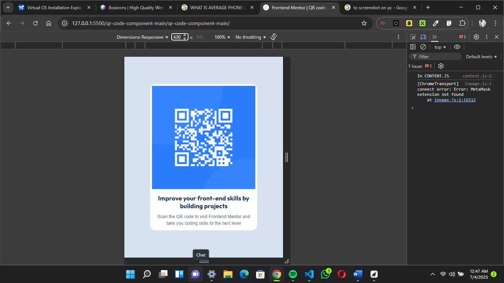
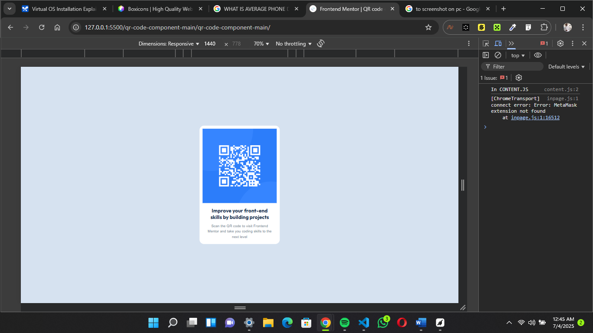

# QR Code

## Overview

This is my solution to the [QR Code Component challenge on Frontend Mentor](https://www.frontendmentor.io/challenges/qr-code-component-iux_sIO_H). I built a responsive web page displaying a QR code with text using HTML and CSS. This project showcases my front-end skills, including responsive design with media queries and a clean layout styled with a slate color palette.

## Features

- **Responsive Design**: Adapts to mobile (430px) and tablet (431px–770px) viewports using media queries.
- **Slate Color Palette**:
  - Slate 300 (`hsl(212, 45%, 89%)`) for background.
  - Slate 500 (`hsl(215, 40%, 50%)`) for text and background.
  - Slate 900 (`hsl(218, 44%, 22%)`) for text.

- **Custom Typography**: Uses the Outfit font from Google Fonts for a modern look.
- **Clean Layout**: Centered card with a QR code image, heading, and description, optimized for readability and accessibility.

## Technologies Used

- **HTML5**: Semantic structure for the QR code card.
- **CSS3**: Flexbox for layout, media queries for responsiveness, and custom styles for the slate color scheme.
- **Google Fonts**: Outfit font for typography.

## Usage

- **Mobile View (≤ 430px)**: The card adjusts to 85% width with reduced padding for compact screens.
- **Tablet View (431px–770px)**: The card scales to 50% width with larger padding and 85vh height.
- **Desktop View (> 1440px)**: The card uses a fixed 23% width for a balanced layout.

Test responsiveness using browser DevTools by setting viewport widths to 320px (e.g., iPhone SE) and 770px (e.g., iPad).

## Screenshots

## Credits

- Challenge by [Frontend Mentor](https://www.frontendmentor.io)
- Coded by Uzoma Nwaiwu (uzomanwaiwu@gmail.com)
- Fonts: [Google Fonts - Outfit](https://fonts.google.com/specimen/Outfit)

## Acknowledgments

- Frontend Mentor for providing the challenge and design assets.
- Uzoma Nwaiwu (Myself) for building and optimizing the solution.